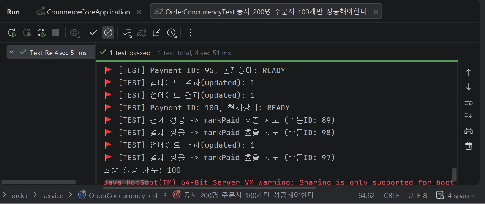

# CommerceCore: 분산 환경을 고려한 이커머스 주문 및 재고 시스템

대규모 트래픽 환경에서 발생할 수 있는 **동시성 이슈**와 **데이터 정합성 문제**를 해결하기 위한 프로젝트입니다. 실제 서비스에서 상품 주문 시 발생할 수 있는 재고 차감/복구 로직을 Redis와 JPA를 활용해 설계했습니다.

## 프로젝트 아키텍처 및 주요 기술
이 프로젝트는 백엔드와 프론트엔드로 나뉘어 있으며, 분산 환경에서의 데이터 일관성을 유지하는 데 중점을 두었습니다.

- **[Backend](./backend/README.md)**: Java 17, Spring Boot, JPA, Redis(Lua Script)
- **[Frontend](./frontend/README.md)**: React 18, Vite, TypeScript, Tailwind CSS, Axios

## 기술적 고민 및 해결 포인트

1. **Redis를 활용한 원자적 재고 관리**:
    - DB의 락(Lock) 없이 Redis의 `DECRBY`와 Lua 스크립트를 사용하여 트래픽 집중 시 발생하는 병목 현상을 해결했습니다.
2. **분산 환경에서의 멱등성(Idempotency) 보장**:
    - `Idempotency Key`를 통해 사용자 실수나 네트워크 오류로 인한 **중복 주문을 차단**했습니다.
3. **데이터 무결성 보호(보상 트랜잭션)**:
    - 주문 생성 후 결제 실패 등 에러 발생 시, 차감되었던 재고를 즉시 복구하는 로직을 구현하여 데이터 불일치를 방지했습니다.

## 성능 검증
- **동시성 정합성 테스트**: 200명의 사용자가 동시에 동일 상품(재고 100개)을 주문하는 상황을 시뮬레이션했습니다. **분산 락(Redisson)**을 활용한 원자적 연산을 통해, 초과 판매 없이 정확히 100개의 재고만 차감되고 나머지 100명은 주문에 실패하는 데이터 정합성을 검증했습니다.
- **테스트 격리 전략**: Testcontainers와 Redis를 조합해 매 테스트마다 독립적인 격리 환경을 구축했습니다. 이를 통해 테스트 간 데이터 간섭을 방지하고, 항상 일관된 테스트 결과를 보장했습니다.

[테스트 코드 상세 보기](https://github.com/Jiyoon0301/commerce-core/blob/main/backend/src/test/java/com/commercecore/order/service/OrderConcurrencyTest.java)

---
상세한 구현 코드와 트러블 슈팅 과정은 각 폴더의 **README**를 확인해 주세요.